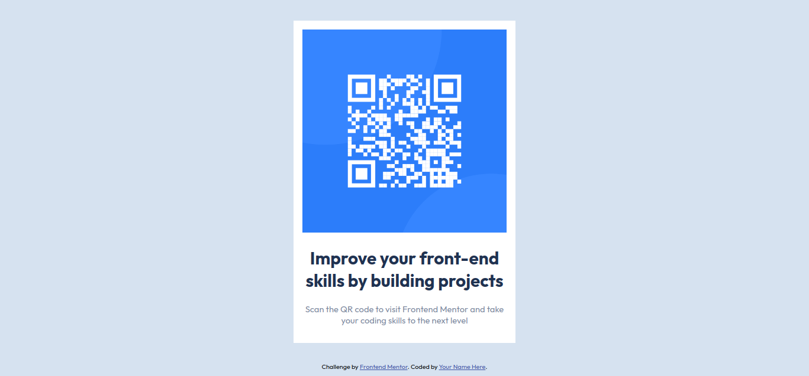

# Frontend Mentor - QR code component solution

This is a solution to the [QR code component challenge on Frontend Mentor](https://www.frontendmentor.io/challenges/qr-code-component-iux_sIO_H).

## Table of contents

- [Overview](#overview)
  - [Screenshot](#screenshot)
- [My process](#my-process)
  - [Built with](#built-with)
  - [What I learned](#what-i-learned)
  - [Useful resources](#useful-resources)
- [Author](#author)


## Overview

### Screenshot




## My process

I built this project with several steps. First, i completed html template code provided by frontendmaster then try to create stylesheets custom file. For styling the webpage, i refer to w3schools especially about flexbox section and font section. 

### Built with

- Semantic HTML5 markup
- CSS custom properties
- Flexbox

### What I learned

I learn about flexbox in this project and how to make a responsive webpage with media queries in css. 

This is some of my favorite written code in this project:


```css
.container{
    display: flex;
    flex-direction: column;
    align-items: center;
}

.card{
    margin: auto;
    width: 350px;
    margin-top: 2%;
    margin-bottom: 2%;
    background-color: white;
    color: white;
    padding: 1em;
    font-size: 15px;
    text-align: center;
}
@media only screen and (max-width: 376px){ 
    .card{
        width: 250px;
        margin: 2px;
        text-align: center;    
        padding: 1em;

    }
    img{
        width: 200px;
        height: 200px;
    
    }
    
}
```


### Useful resources

- [Flexbox Resources](https://www.w3schools.com/css/css3_flexbox.asp) - This helped me for making a flexbox.
- [Responsive Web Design Resources](https://www.w3schools.com/css/css_rwd_mediaqueries.asp) - This is an amazing article which helped me finally understand responsive web design. I'd recommend it to anyone still learning this concept.

## Author

- Frontend Mentor - [@khoirulakmal](https://www.frontendmentor.io/profile/khoirulakmal)
- Twitter - [@khoirulakmal_](https://twitter.com/khoirulakmal_)

